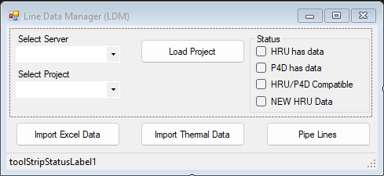

# Process Line Data Manager

## Usage
This application was used to import "seed" data from an external source (Excel and/or MS SQL) into MS SQL. The data being imported needed to be manipulated by the users before being uploaded into the final project database.

## Main Form
This is the screen that would be presented when opening the application:

